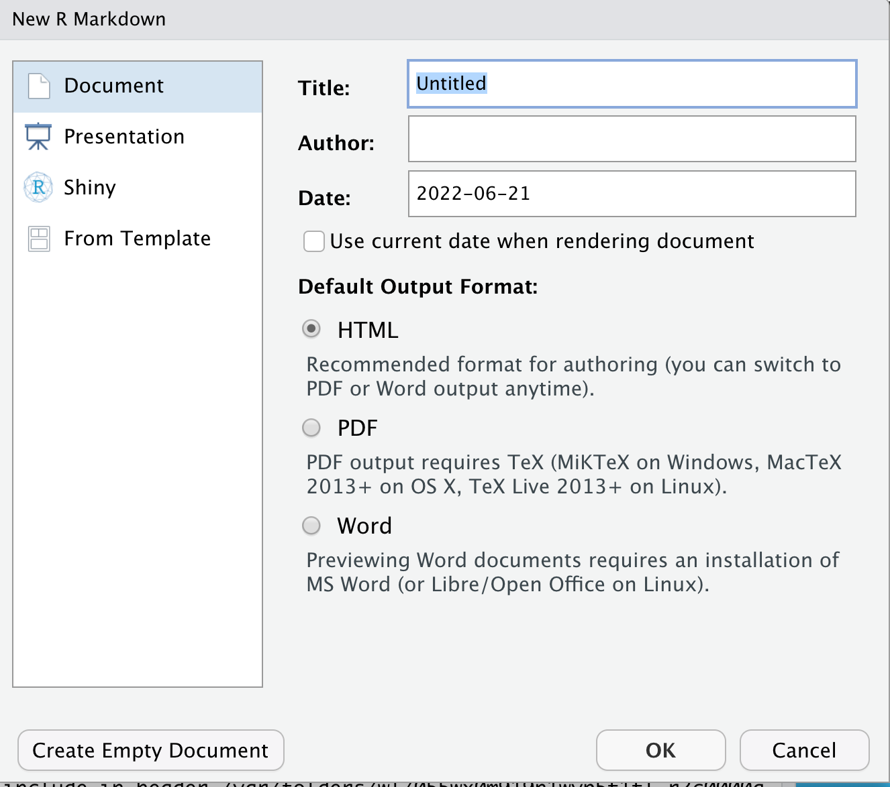
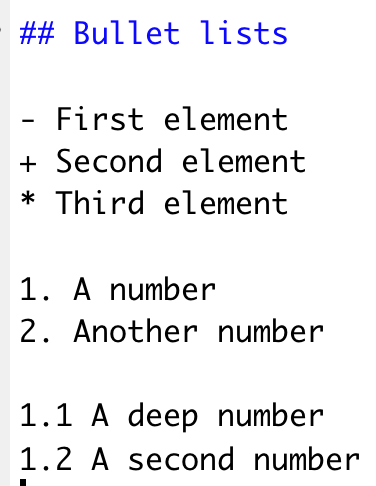

```{r xaringanExtra-clipboard, echo=FALSE}
xaringanExtra::use_clipboard()
```

# Applications

.left-column[<br><br><br>
```{r, echo=FALSE, out.width='100%', fig.align='center'}
knitr::include_graphics("img/rmarkdown.png")
```
]

.right-column[<br>
- Rendering scripts (knitr)
- Creating reports (pagedown-pdf)
- Websites (pagedown, pkgdown)
- Books (bookdown)
- Presentations (xaringan)
- CV (vitae, datadrivencv)
- Thesis (thesisdown)
]

---
# R script vs R markdown

.pull-left[
## Script

- Code is written directly on the script
- Comments are marked with '#'
- Output is printed on the console
]

.pull-right[
## R markdown

- Code is written inside R chunks
- Comments are written directly on the document
- Output to multiple formats
]

---
# Starting a file

- File > New file > R Markdown
- Assign a title
- Create empty document

```{r, echo=FALSE, out.width='50%', fig.align='center'}

```

---
# Starting a file

- Open a new chunk

```{r, echo=FALSE, out.width='40%', fig.align='center'}

```

---
# Starting a file

- Start writing some code

```{r, warning=FALSE, message=FALSE}
library(tidyverse)
library(janitor)
sinai_covid <- read_csv("sinai_covid.csv")
sinai_covid <- clean_names(sinai_covid)
```

```{r, eval=FALSE}
sinai_covid %>% 
  select(age, ethnicity, facility) %>% 
  head()

ggplot(sinai_covid, aes(x = age, color = facility)) +
  geom_line()
```

---
# Chunk options

- echo
- eval
- warnings
- message
- out.width
- out.height
- fig.align
- fig.alt
- ...

---
# Bullet lists

You can use bullets (+, -, *) or numbers (1, 1.1) 

```{r,echo=FALSE, out.width='30%', fig.align='center'}

```

---
# Working with tables

Using the kableExtra package

```{r, message=FALSE, warning=FALSE, eval=FALSE}
library(kableExtra)
x <- sinai_covid %>% 
  select(age, ethnicity, facility) %>% 
  head(5)

kable(x, caption = "Head of sinai covid") %>%
  kable_styling()
```

---

<br>

```{r, message=FALSE, warning=FALSE, echo=FALSE}
library(kableExtra)
x <- sinai_covid %>% 
  select(age, ethnicity, facility) %>% 
  head(5)

kable(x, caption = "Head of sinai covid") %>%
  kable_styling()
```

---

More styling

```{r, message=FALSE, warning=FALSE, eval=FALSE}
kable(x, caption = "Head of sinai covid") %>%
  kable_styling() %>%
  kable_classic(full_width = FALSE, 
                html_font = "Cambria")
```

---
<br>

```{r, message=FALSE, warning=FALSE, echo=FALSE}
kable(x, caption = "Head of sinai covid") %>%
  kable_styling() %>%
  kable_classic(full_width = FALSE, html_font = "Cambria")
```

---

Using the flextable package

```{r, warning=FALSE, message=FALSE}
library(flextable)
flextable(x) %>% 
  autofit()
```

---
# The yaml section

- Add a title

```{r, eval=FALSE}
---
title: "My first pipeline"
output:
  html_document
---
  
```

--

- Create a table of contents

```{r, eval=FALSE}
---
title: "My first pipeline"
output:
  html_document:
    toc: true
    toc_depth: 2
---
```

---

- Floating table of contents

```{r, eval=FALSE}
---
title: "My first pipeline"
output:
  html_document:
    toc: true
    toc_float: true
---
```

---

# Animated plots with gganimate

```{r, eval=FALSE}
library(gganimate)

influenza <- read.csv("influenza_vaccination.csv")
influenza <- clean_names(influenza)

influenza %>% 
    group_by(mmwr_year, race_eth) %>% 
    summarise(mean_vaccinated = mean(vaccinated)) %>% 
    ggplot(aes(factor(mmwr_year), mean_vaccinated, 
               color = race_eth)) +
    geom_point() 
```

---

Adding time transition

```{r, eval=FALSE}
influenza %>% 
    group_by(mmwr_year, race_eth) %>% 
    summarise(mean_vaccinated = mean(vaccinated)) %>% 
    ggplot( aes(race_eth, mean_vaccinated)) +
    geom_col() +
    theme(axis.text.x = element_text(angle = 90)) +
    transition_states(mmwr_year)
```

---

Adding time as title

```{r, eval=FALSE}
influenza %>% 
    group_by(mmwr_year, race_eth) %>% 
    summarise(mean_vaccinated = mean(vaccinated)) %>% 
    ggplot( aes(race_eth, mean_vaccinated)) +
    geom_col() +
    theme(axis.text.x = element_text(angle = 90)) +
    labs(title = 'Year: {frame_time}') +
    transition_time(mmwr_year)
```

---
.pull-left[<br><br><br><br><br><br><br>
.center[
# Thanks!
]
]

.pull-right[<br><br><br><br><br>
```{r,echo=FALSE,out.width='110%',fig.align='center'}
knitr::include_graphics("img/thanks.png")
```
]
